# Purpose

This repository contains the solutions for the Data Science Practical
Project. It involves four key questions: \* Q1: An evaluation of global
coffee roasters to identify the best value-for-money options based on
customer ratings, cost, and descriptive keywords. \* Q2: An analysis of
historical US baby naming trends to measure name persistence over time
\* Q3: An assessment of loan default rates and credit rating accuracy in
the United States. \* Q4: A report on Netflix movie characteristics,
evaluating genres, runtimes, audience ratings, and descriptive text
themes.

# General set-up

``` r
## Set-up

# Clearing environment and loading functions:
rm(list = ls()) 
gc() 
library(pacman)
p_load(tidyverse)
list.files('code/', full.names = T, recursive = T) %>% .[grepl('.R', .)] %>% as.list() %>% walk(~source(.))

# Setting up folder structure:
CHOSEN_LOCATION <- "/Users/samtheron/Desktop/Data Sc./22921893_solution"
# Texevier::create_template(directory = glue::glue("{CHOSEN_LOCATION}/"), template_name = "22921893Question1")
# Texevier::create_template(directory = glue::glue("{CHOSEN_LOCATION}/"), template_name = "22921893Question2")
# Texevier::create_template(directory = glue::glue("{CHOSEN_LOCATION}/"), template_name = "22921893Question3")
# Texevier::create_template(directory = glue::glue("{CHOSEN_LOCATION}/"), template_name = "22921893Question4")
```

# Question 1: Finding The Best Coffee Roaster

## Set-up code

``` r
# Clearing environment:
gc() 
library(pacman)

# Loading packages:
p_load(tidyverse, lubridate, stringi, ggridges, patchwork)

# Sourcing functions:
list.files('22921893Question1/code/', full.names = T, recursive = T) %>% as.list() %>% walk(~source(.))

# Loading data:
raw_coffee <- read_csv("22921893Question1/data/Coffee/Coffee.csv")
```

## Loading and cleaning data

First, I want to inspect the data to check its format and how messy it
is

``` r
raw_count <- raw_coffee |> 
    count(roast)

raw_country_counts <- raw_coffee |> 
    count(loc_country) |> 
    arrange(desc(n))

raw_origin_pairs <- raw_coffee |> 
    distinct(origin_1, origin_2) |> 
    slice_head(n = 15)
```

In order to handle uppercase column names and load the coffee data the
load_data function is used:

``` r
coffee <- load_data("22921893Question1/data/Coffee/Coffee.csv")
```

    ## Rows: 2095 Columns: 12
    ## ── Column specification ────────────────────────────────────────────────────────
    ## Delimiter: ","
    ## chr (10): name, roaster, roast, loc_country, origin_1, origin_2, review_date...
    ## dbl  (2): Cost_Per_100g, Rating
    ## 
    ## ℹ Use `spec()` to retrieve the full column specification for this data.
    ## ℹ Specify the column types or set `show_col_types = FALSE` to quiet this message.

Additional issue with the data: the dates are in (Mon-YY) format; the
country column has a typo where it reads “United States and Floyd”; and
there are missing values in the roast column. Therefore:

``` r
coffee_clean <- clean_coffee_data(coffee)
```

## Cost and rating

First, we will investigate the relationship between cost and rating by
the location of the roaster. As rating is a discrete variable, we will
use a boxplot.

``` r
box <- plot_box_cost_rating(coffee_clean)

box
```

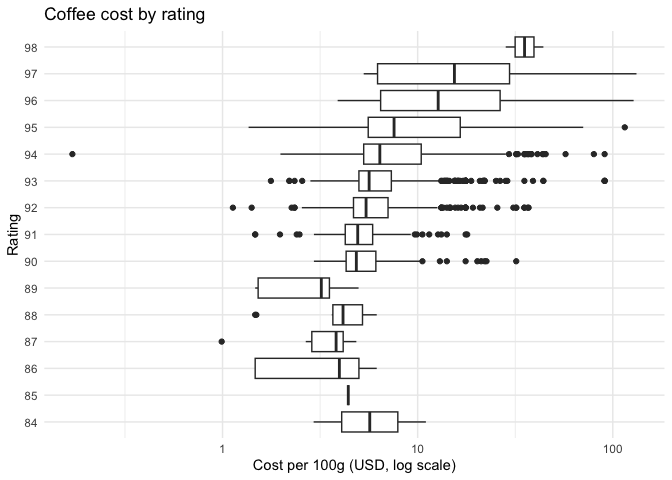
<p class="caption">
Cost and rating.
</p>

``` r
save_plot(box, "Cost and rating.png")
```

The plot displays an upward trend, where higher ratings cluster at a
higher cost. The mid-range of ratings overlap significantly, with long
tails in both directions. As the United States (n = 1332) and Taiwan (n
= 549) are the countries which roast the most coffee beans, they are the
predominant countries in the data. To visualise the cost distribution of
these countries the following functions are run:

``` r
# Density of cost
cost_density <- plot_country_density(coffee_clean, cost_per_100g, c("United States", "Taiwan")) 
cost_density
```

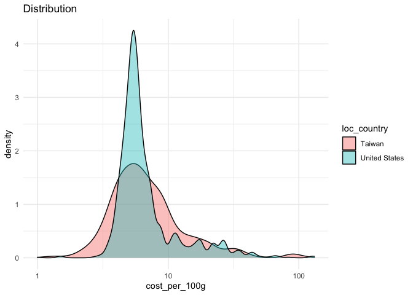
<p class="caption">
The US and Taiwan.
</p>

``` r
save_plot(cost_density, "The US and Taiwan.jpg")
```

As the goal should ultimately be to find good value coffee, I define a
value metric as rating divided by cost per 100g. This tells the buyer
how much rating she is getting per dollar spent. The function also
filters coffees with implausibly low cost.

``` r
coffee_clean <- add_value(coffee_clean)
```

After removing the two implausible entries, the value metric now ranges
from 0.7 to 81.4, with a mean of 15.4 and a median of 16.0. Coffee costs
are skewed right, indicating most coffees are reasonably priced with a
few expensive coffees also present in the sample. In contrast, ratings
are tightly clustered, ranging between 84 and 98.

``` r
desc_stats <- numeric_summary(coffee_clean) |> 
    knitr::kable(caption = "Descriptive statistics")

desc_stats
```

| variable      | mean | median |   sd |  min |   max |
|:--------------|-----:|-------:|-----:|-----:|------:|
| cost_per_100g |  9.1 |    5.9 | 10.3 |  1.1 | 132.3 |
| rating        | 93.1 |   93.0 |  1.6 | 84.0 |  98.0 |
| value         | 15.4 |   16.0 |  7.6 |  0.7 |  81.4 |

Descriptive statistics

The following table depicts the Top 10 roasters by median value.
Inclusion as a candidate for best value roaster requires at least 5
coffees. Mr. Chao Coffee, El Gran Cafe, and Jackrabbit Java lead with
median values around 22-25. These roasters deliver substantially more
rating per dollar spent than the sample median of 16.0.

``` r
candidate_roasters <- best_value_roasters(coffee_clean, min_n = 5)

t10candidates <- candidate_roasters |> 
  slice_head(n = 10) |> 
  knitr::kable(digits = 2, caption = "Top 10 roasters by value (median)")

t10candidates
```

| roaster                  |   n | median_cost | median_rating | median_value |
|:-------------------------|----:|------------:|--------------:|-------------:|
| Mr. Chao Coffee          |   5 |        3.67 |            92 |        24.80 |
| El Gran Cafe             |  29 |        3.82 |            91 |        23.56 |
| Jackrabbit Java          |  23 |        4.12 |            92 |        22.33 |
| Coffee By Design         |   7 |        4.08 |            93 |        22.30 |
| Kakalove Cafe            | 142 |        4.25 |            94 |        22.00 |
| Mystic Monk Coffee       |   9 |        4.11 |            91 |        21.90 |
| Propeller Coffee         |  10 |        4.32 |            93 |        21.67 |
| San Francisco Bay Coffee |   9 |        4.17 |            90 |        21.10 |
| Espresso Republic        |  11 |        4.41 |            90 |        20.63 |
| Creation Food Co.        |   5 |        4.51 |            91 |        19.96 |

Top 10 roasters by value (median)

## Indicators of good coffee

Per the practical instructions, the most important keywords that
Stelenbosch students have used as indicators of good coffee are: -
sweet - finish - mouthfeel - structure - aroma - chocolate - toned

Therefore, I first generate a new dataset, which includes a count of
these important keywords individually as well as a total column.

``` r
coffee_keywords <- count_keywords(coffee_clean, c("mouthfeel", "aroma", "chocolate", "sweet", "finish", "toned", "structure"))
```

This new dataset is more complete, as it includes valuable information:
the frequency of keywords which Stellenbosch students regard as
desirable. This is valuable information, as it provides an indicator of
what qualities may make a coffee in Stellenbosch a best seller.

## Which roaster is the ‘best’?

To see whether the roasters with the best value also score well on
keyword indicators, I add the average keyword count per roaster to the
top 10 value rankings. This indicates there a tradeoff when choosing a
roaster to supply coffee. The roasters with the highest rating
(e.g. Kakalove Cafe) are more expensive, and do not necessarily have a
higher frequency of desirable keywords. is Two roasters stand out in the
table as having a particularly high keyword average, Mystic Monk Coffee
and Creation Food Co.

``` r
keyword_avg <- coffee_keywords |> 
    summarise(total_keywords_mean = mean(total_keywords, na.rm = TRUE), .by = roaster)

candidate_roasters <- candidate_roasters |> 
    left_join(keyword_avg, by = "roaster")

t10complete <- candidate_roasters |> 
    slice_head(n = 10) |> 
    knitr::kable(digits = 2, caption = "Top 10 roasters by value, with average keywords")

t10complete
```

| roaster | n | median_cost | median_rating | median_value | total_keywords_mean |
|:-------------------|---:|---------:|-----------:|----------:|---------------:|
| Mr. Chao Coffee | 5 | 3.67 | 92 | 24.80 | 8.20 |
| El Gran Cafe | 29 | 3.82 | 91 | 23.56 | 8.59 |
| Jackrabbit Java | 23 | 4.12 | 92 | 22.33 | 8.65 |
| Coffee By Design | 7 | 4.08 | 93 | 22.30 | 9.29 |
| Kakalove Cafe | 142 | 4.25 | 94 | 22.00 | 8.61 |
| Mystic Monk Coffee | 9 | 4.11 | 91 | 21.90 | 11.33 |
| Propeller Coffee | 10 | 4.32 | 93 | 21.67 | 9.00 |
| San Francisco Bay Coffee | 9 | 4.17 | 90 | 21.10 | 9.11 |
| Espresso Republic | 11 | 4.41 | 90 | 20.63 | 9.36 |
| Creation Food Co. | 5 | 4.51 | 91 | 19.96 | 10.60 |

Top 10 roasters by value, with average keywords

The following plot depicts the trade-off when choosing a roaster to
supply coffee. As high-rating-roasters are often more expensive, and do
not necessarily have more desirable characteristics (as proxied by the
frequency of desirable words in the reviews). The following plot
displays the relationship between rating (mean) and cost (mean) for each
roasters. A clear positive relationship can be seen between rating and
cost. The colour corresponds to the mean frequency of desirable words
that these roasters have in their coffee (per the reviews). The three
roasters that most often have desirable words in their coffee’s
descriptions are Mystic Monk Coffee, Creation Food Co., and Corvus
Coffee Roasters. Of these three, only two appeared in the top value
rankings: Mystic Monk Coffee and Creation Food Co. Therefore, it is
contended these are the ‘best’ roasters, as they provide provide great
value while having a high frequency of desirable keywords.

``` r
roaster_counts <- coffee_clean |> 
    count(roaster) |> 
    arrange(desc(n))

roaster_stats <- summarise_numeric(coffee_keywords, roaster) |> 
    left_join(roaster_counts, by = "roaster") |> 
    filter(n >= 5) |> 
    arrange(desc(rating_mean))

roaster_scatter <- plot_roaster_scatter(roaster_stats)

roaster_scatter
```

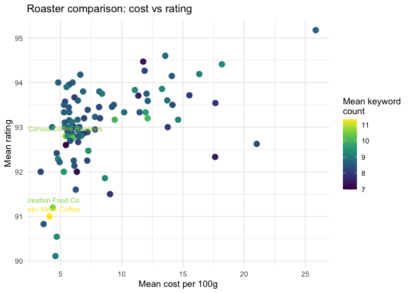
<p class="caption">
Roaster Scatterplot.
</p>

``` r
save_plot(roaster_scatter, "Roaster Scatterplot.png" )
```

# Question 2: Baby Naming Trends

## Set-up code

``` r
# Clearing environment:
gc() 
library(pacman)

# Loading packages:
p_load(tidyverse, lubridate, patchwork)

# Sourcing functions:
list.files('22921893Question2/code/', full.names = T, recursive = T) %>% as.list() %>% walk(~source(.))

# Loading data:
baby_names <- read_rds("22921893Question2/data/US_Baby_names/Baby_Names_By_US_State.rds")
t100billboard <- read_rds("22921893Question2/data/US_Baby_names/charts.rds")
hbo_titles <- read_rds("22921893Question2/data/US_Baby_names/HBO_titles.rds")
hbo_credits <- read_rds("22921893Question2/data/US_Baby_names/HBO_credits.rds")
```

## Baby name persistence

First, I get the national names counts, or, the sum of each name across
all the states for each year and gender

``` r
national_counts <- national_name_counts(baby_names)
```

Second, I rank all the names by their count (rank 1 being the most
popular), within each year-gender pairing.

``` r
ranked_counts <- rank_names(national_counts)
```

Third, I create a function for the top n ranked names for year-gender
pairings

``` r
top25 <- top_n_names(ranked_counts, n = 25)
```

Fourth, in order to measure persistence, I tracked each each years top
25 names (male and female), and then checked where they ranked 1, 2 and
3 years later.The Spearman rank correlation is used, where a rank close
to 1 means the names stayed in the same order, and close to 0 means they
changed significantly.

``` r
# First, I test rank_correlation()
test_corr <- rank_correlation(top25, ranked_counts, lag = 1)

# Applying rank_correlation across lags 1-3 and combining
all_correlations <- c(1, 2, 3) |>
  map_df(~ rank_correlation(top25, ranked_counts, lag = .))
```

Fifth, I plot the correlation over time.

``` r
persistence_plot <- rank_persistence_plot(all_correlations)

persistence_plot
```

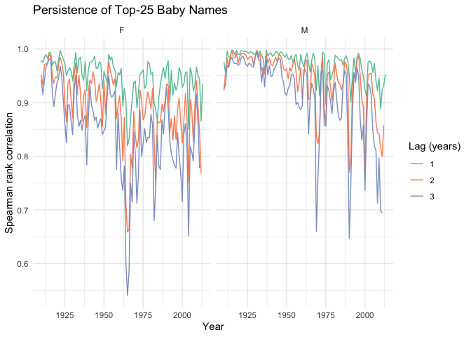
<p class="caption">
The Persistence of Baby Names.
</p>

``` r
save_plot(persistence_plot, "persistence_plot.png")
```

The plot does indicate that the agencies suspicions may have been
correct, as there does appear to be a drop-off in persistence of the top
25 names from around 1990. The following table further confirms the
agencies suspicion. At each lag, the mean correlation drops from the
pre- to post-1990 period. This is possibly attributable to cultural
influences such as social media and streaming causing more frequent
waves of popular names. This motivates the subsequent section, which
investigates drivers of baby names.

``` r
corr_table <- correlation_period_table(all_correlations)
corr_table
```

| Period    | Lag (years) | Mean Correlation |
|:----------|------------:|-----------------:|
| Post 1990 |           1 |            0.944 |
| Pre 1990  |           1 |            0.966 |
| Post 1990 |           2 |            0.879 |
| Pre 1990  |           2 |            0.929 |
| Post 1990 |           3 |            0.825 |
| Pre 1990  |           3 |            0.893 |

Mean Correlation around 1990

## Investigating naming spikes

First, I check the distribution of the data in order to get a threshold
which will be use to filter out low-volume names. 500 is chosen as the
threshold.

``` r
# Checking distributions
count_summary <- summary(national_counts$count)

count_quantiles <- quantile(national_counts$count, probs = c(0.5, 0.75, 0.9, 0.95, 0.99))
```

Then, I calculate the naming spikes as year-on-year percentage changes.

``` r
spikes <- name_spikes(national_counts)

top_spikes <- top_spikes_table(spikes)
top_spikes
```

| Name     | Gender | Year | Count | % Change |
|:---------|:-------|-----:|------:|---------:|
| Deneen   | F      | 1964 |  1572 |    31340 |
| Aaliyah  | F      | 1994 |  1412 |    28140 |
| Mallory  | F      | 1983 |   658 |    13060 |
| Tenley   | F      | 2010 |   650 |    12900 |
| Tammie   | F      | 1957 |   584 |    11580 |
| Jalen    | M      | 1992 |   583 |     9617 |
| Cataleya | F      | 2012 |   616 |     7600 |
| Elian    | M      | 2000 |   542 |     5922 |
| Deanna   | F      | 1937 |  1605 |     5632 |
| Katina   | F      | 1972 |  2726 |     5579 |

Top 10 Year-on-Year Baby Name Spikes

While a number of names are likely candidates for being driven by
pop-culture influence, the name Aaliyah has the 2nd largest year-on-year
spike, with a percentage change of 28 140 in 1994. As the following
search indicates, the pop singer Aaliyah’s first entry into the
Billboard top 100 chart was also in 1994.

``` r
aaliyah_query <- search_billboard(t100billboard, "Aaliyah") |> 
    head(20)
```

I create the following graph in order to visualise the spike in
popularity with and the rise of Aaliyah on the Billboard charts.

``` r
aaliyah <- name_spike_plot(national_counts, "Aaliyah", "F", c(1975, 2014)) /
    billboard_weeks_plot(t100billboard, "Aaliyah", c(1975, 2014))

aaliyah
```

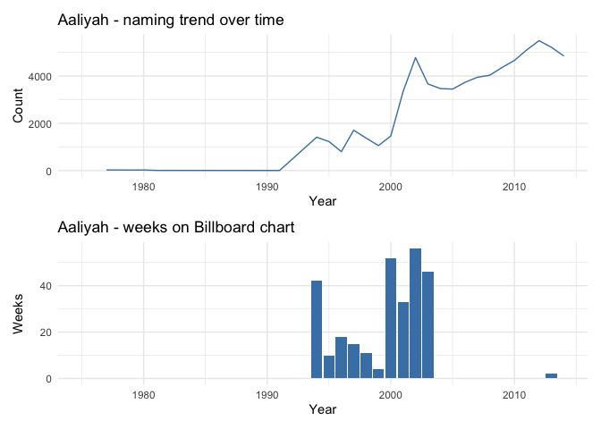
<p class="caption">
The Name Aaliyah, Over Time.
</p>

``` r
save_plot(aaliyah, "aaliyah.png")
```

This indicates that pop-culture, fashionable trends, and celebrity
culture can influence naming trends over time.

# Question 3: Defaults and Credit Ratings in the United States

## Set-up code

``` r
# Clearing environment:
gc() 
library(pacman)

# Loading packages:
p_load(tidyverse, lubridate, readxl, ggridges, usmap)

# Sourcing functions:
list.files('22921893Question3/code/', full.names = T, recursive = T) %>% as.list() %>% walk(~source(.))

# Loading data:
loan_credit <- read_rds("22921893Question3/data/Loan_Cred/loan_data.rds")
dictionary <- read_excel("22921893Question3/data/Loan_Cred/Dictionary.xlsx")
```

## Loading data and cleaning

I first inspect the raw data to assess how and what to clean. The
dataset has 145 columns, with many containing a large amount of missing
values. The columns relevant to the current analysis, such as loan
status, grade, and home ownership are all relatively complete.

``` r
overview <- data_overview(loan_credit) 
```

To clean the data, I select only the relevant columns. Furthermore, I
create a binary outcome variable for whether the loan status is fully
paid off or not. The summary statistics of the cleaned data indicate
outliers are present in the data. For instance, annual income has a
maximum of 9 500 000. Similarly, debt-to-income also has a hanful of
extreme outliers, with a handful of pre-cleaning observations with a dti
equal to 999. The cleaning drops the most extreme dti observations.

``` r
loan_clean <- clean_loan_data(loan_credit)

sum_stats <- numeric_summary(loan_clean) |> 
    knitr::kable(caption = "Summary statistics")

sum_stats
```

| variable   |    mean | median |      sd | min |     max |
|:-----------|--------:|-------:|--------:|----:|--------:|
| emp_length |     6.1 |      6 |     3.6 | 1.0 |      10 |
| dti        |    18.8 |     18 |    10.5 | 0.0 |     822 |
| annual_inc | 78865.8 |  66000 | 80722.6 | 0.0 | 9550000 |
| int_rate   |    13.0 |     12 |     5.0 | 5.3 |      31 |
| default    |     0.2 |      0 |     0.4 | 0.0 |       1 |

Summary statistics

## Default rates on short-term loans

First, I filter to short-term loans, and then create a function which
calculates the default rate for any group. Among short term loans (36
months), the default rate falls as home ownership improves. Renters
default at 23.1%, compared to 19.9% for owners and 15.2% for those still
paying a mortgage. This provides an indication that owning vs renting
matters. Although, the fact that mortgage holders default less than
owners is a less intuitive result.

``` r
loan_short <- loan_clean |> 
    filter(term == "36 months")

# Home ownership and default rates for short-term loans
short_default_home <- default_rate_by_group(loan_short, home_ownership) |>
  knitr::kable(caption = "Default rate by home ownership")

short_default_home
```

| home_ownership |      n | default_rate |
|:---------------|-------:|-------------:|
| MORTGAGE       | 139189 |         15.2 |
| RENT           | 120789 |         23.1 |
| OWN            |  37406 |         19.9 |
| ANY            |     63 |         20.6 |

Default rate by home ownership

``` r
# Employment length and default rates for short-term loans
short_default_emp <- default_rate_by_group(loan_short, emp_length) |>
  knitr::kable(caption = "Default rate by employment length")

short_default_emp
```

| emp_length |     n | default_rate |
|-----------:|------:|-------------:|
|          5 | 18329 |         18.8 |
|         10 | 96678 |         17.0 |
|          3 | 24559 |         19.3 |
|          4 | 17909 |         19.0 |
|          1 | 44381 |         19.6 |
|          8 | 12735 |         18.2 |
|         NA | 21655 |         27.9 |
|          6 | 12526 |         17.9 |
|          9 | 10905 |         18.6 |
|          2 | 27805 |         19.0 |
|          7 |  9965 |         18.5 |

Default rate by employment length

``` r
# Plotting home ownership and default rates
default_rate_home_bar <- default_rate_bar(loan_short, home_ownership)

default_rate_home_bar
```

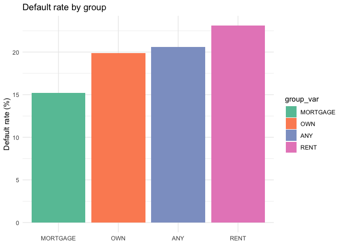
<p class="caption">
Home ownership and default rates.
</p>

``` r
save_plot(default_rate_home_bar, "Home ownership and default rates.png")
```

Employment length does not appear to be a meaningful indicator of
default on short-term loans. Employees with 10+ years have a slightly
lower default rate, although the default rates between all employment
length groups is very similar. The one notable exception is the group
with a missing employment length, which defaults at 27.9%. This is
possibly attributable to unemployed or self-employed individuals, who do
not report their employment length.

``` r
missing_income <- loan_short |>
  mutate(emp_missing = is.na(emp_length)) |>
  summarise(
    n             = n(),
    mean_income   = mean(annual_inc, na.rm = TRUE),
    median_income = median(annual_inc, na.rm = TRUE),
    .by = emp_missing
  ) |> 
    knitr::kable(caption = "Income of missing employment oberservations")

missing_income
```

| emp_missing |      n | mean_income | median_income |
|:------------|-------:|------------:|--------------:|
| FALSE       | 275792 |    79248.64 |         65000 |
| TRUE        |  21655 |    49109.66 |         42700 |

Income of missing employment oberservations

## State differences in short-term loan defaults

Now, I analyse differences in the defaults on short-term loans by state.
There is significant variability in the average default rate across
states. States such as Arkansas, Oklahoma, Louisiana, and Alabama have
the highest default rates with more than 20%. The map plot confirms that
there are interstate differences in short-term loan defaults.
Specifically, Southern States have a higher propensity to default. The
states with the lowest propensity to default are more Northern, coastal
states, such as Oregon.

``` r
state_bar <- plot_state_bar(loan_short)

state_bar
```

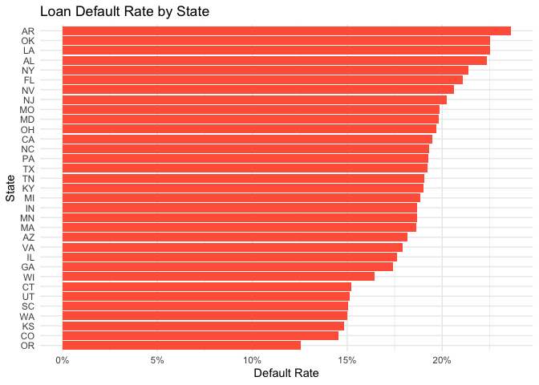
<p class="caption">
Default rate for American states.
</p>

``` r
save_plot(state_bar, "Default rate for American states.png")
```

``` r
map_plot <- plot_state_map(loan_short)

map_plot
```

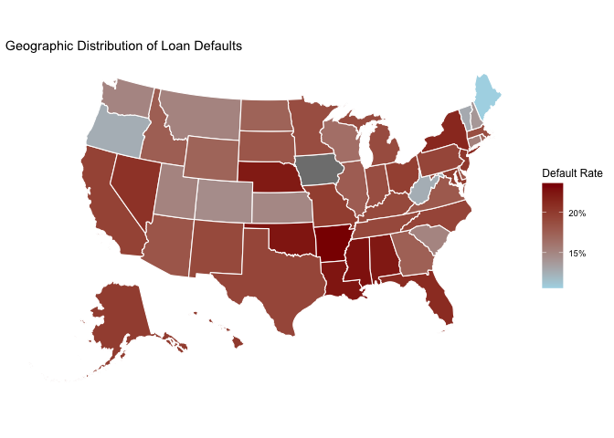
<p class="caption">
Default rate in the United States
</p>

``` r
save_plot(map_plot, "Default rate in the United States.png")
```

## What does grade predict?

The following table displays the relationship between average default
rates and credit grades. As expected, the default rate rises steadily
from Grade A to Grade G. This indicates the credit grading system tracks
default risk well. The previous section highlighted two states of
interest, Arkansas and Oregon, representing the top and bottom of the
load default rate spectrum, respectively. Therefore, I plot the average
default rate for each credit rate for both these states. I add Texas as
it fell in the midrange of the state loan default rate.

``` r
# Default rate by grade table
default_rate_by_grade <- default_rate_by_group(loan_short, grade) |>
    arrange(desc(default_rate)) |> 
    knitr::kable(caption = "Default rate by credit grade")

default_rate_by_grade
```

| grade |      n | default_rate |
|:------|-------:|-------------:|
| G     |    523 |         56.2 |
| F     |   2141 |         48.0 |
| E     |   9862 |         39.7 |
| D     |  35625 |         32.5 |
| C     |  83204 |         24.0 |
| B     | 101540 |         15.2 |
| A     |  64552 |          6.7 |

Default rate by credit grade

As expected, Arkansas generally has a higher default rate at each credit
rating level, followed by Texas and Oregon. This indicates that the
grade-default relationship is consistent in this three state sub-sample.
The only exception is Grade G, which makes up a small amount of the
observations, indicating that the prominence of Grade G in the plot may
be unreliable.

``` r
# Default rate by (selected) states barplot
sample_states <- default_rate_by_grade_state(loan_short, c("AR", "TX", "OR"))

sample_states
```

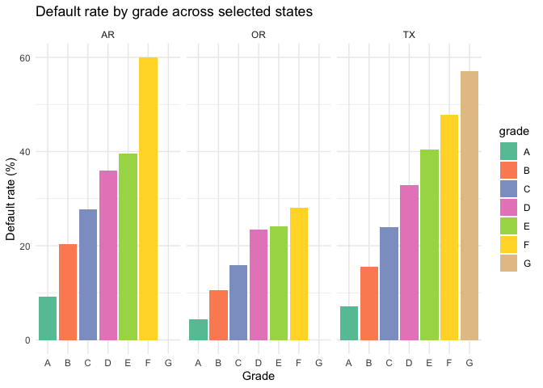
<p class="caption">
Default rate by grade across Arkansas, Oregon, and Texas.
</p>

``` r
save_plot(sample_states,"Default rate by grade across Arkansas, Oregon, and Texas.png")
```

# Question 4: Netflix Report

## Set-up code

``` r
# Clearing environment:
gc() 
library(pacman)

# Loading packages:
p_load(tidyverse, lubridate, ggridges, tidytext)

# Sourcing functions:
list.files('22921893Question4/code/', full.names = T, recursive = T) %>% as.list() %>% walk(~source(.))

# Loading data:
titles <- read_rds("22921893Question4/data/netflix/titles.rds")
credits <- read_rds("22921893Question4/data/netflix/credits.rds")
movies <- read_csv("22921893Question4/data/netflix/netflix_movies.csv")
```

## Loading data and cleaning

First, I filtered and cleaned the title data. I filtered the data to
only include movies. I cleaned the data to remove column formatting
issues. As some of the columns had two values per observation
(e.g. multiple genres), I pivoted longer to allow for genre and country
based analysis.

``` r
# Filtering to only movies
movies_titles <- titles |> 
  filter(type == "MOVIE")

# Cleaning the formatting of the production_countries and genres columns
movies_long <- movies_titles |> 
  unnest_list_string(production_countries) |> 
  unnest_list_string(genres)
```

## Types of movies by country

I first identify the identify the top countries. The five countries
which are the most prolific producers are the United States, India,
France, and Canada.

``` r
# Top countries
top_countries <- movies_long |> 
  distinct(id, production_countries) |> 
  count(production_countries, sort = TRUE) |> 
  slice_head(n = 5)

top_countries

# Top genres by country
top_genres_by_country <- movies_long |> 
  filter(production_countries %in% top_countries$production_countries) |> 
  count(production_countries, genres, sort = TRUE) |> 
  slice_max(n, n = 5, by = production_countries)
```

``` r
# Tabulating
top_table <- top_genres_by_country |> 
  knitr::kable(caption = "Top 5 Genres by Country")
top_table
```

| production_countries | genres        |   n |
|:---------------------|:--------------|----:|
| US                   | comedy        | 630 |
| US                   | drama         | 618 |
| US                   | documentation | 365 |
| US                   | thriller      | 353 |
| US                   | action        | 251 |
| IN                   | drama         | 448 |
| IN                   | comedy        | 252 |
| IN                   | romance       | 192 |
| IN                   | thriller      | 174 |
| IN                   | action        | 149 |
| GB                   | drama         | 116 |
| GB                   | thriller      |  80 |
| GB                   | comedy        |  77 |
| GB                   | documentation |  59 |
| GB                   | action        |  49 |
| FR                   | drama         | 113 |
| FR                   | european      | 100 |
| FR                   | comedy        |  51 |
| FR                   | thriller      |  51 |
| FR                   | crime         |  36 |
| CA                   | drama         |  63 |
| CA                   | comedy        |  56 |
| CA                   | thriller      |  40 |
| CA                   | animation     |  31 |
| CA                   | family        |  31 |

Top 5 Genres by Country

The results from analysis the top genres by countries illustrate
heterogeneity in preferences. Comedy and drama dominate in the United
States, India, and Canada. Documentation films are strong in the United
States, and the UK.

``` r
country_genre <- genre_by_country_plot(top_genres_by_country)

country_genre
```

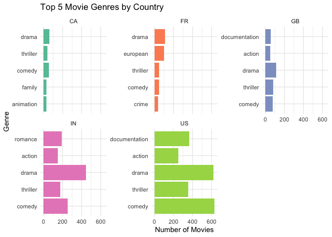
<p class="caption">
Top Generes by Country.
</p>

``` r
save_plot(country_genre, "country_genre.png")
```

## Distribution of ratings by genre

Here, I visualise the distribution of ratings by genre. History,
documentation, war and sport films are more commonly well-received.
Horror, family, sci-fi, and action lie at the bottom range of the rating
distribution. However, most genres cluster around a mean score of
between 6 and 7, and are fairly widely spread. This indicates genre
alone is a weak predictor of ratings.

``` r
genre_ridge <- genre_score_ridge_plot(movies_long)

genre_ridge
```

    ## Picking joint bandwidth of 0.253

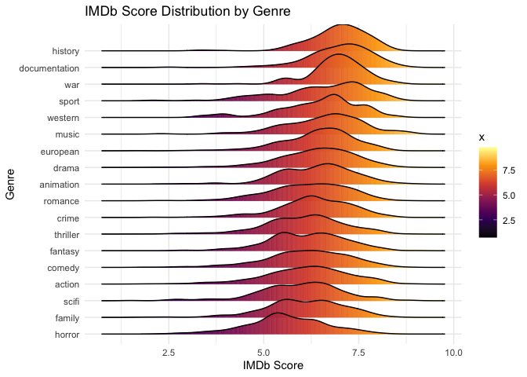
<p class="caption">
IMDb Score Distribution by Genre.
</p>

``` r
save_plot(genre_ridge, "genre_ridge.png")
```

    ## Picking joint bandwidth of 0.253

## Distribution of runtime by genre

Here, I visualise the distribution of runtime by genre. Similar to the
ratings distribution, most genres are clustered over a similar mean
(just below 100 minutes) with fairly wide spreads.

``` r
runtime_violin <- genre_runtime_violin_plot(movies_long)

runtime_violin
```

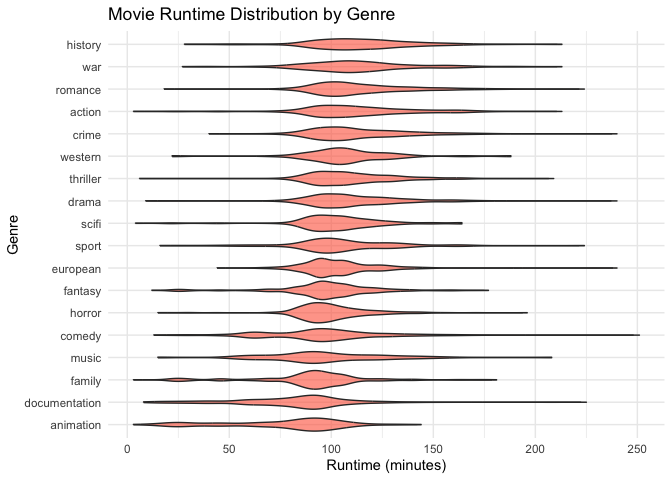
<p class="caption">
Movie Runtime Distribution by Genre.
</p>

``` r
save_plot(runtime_violin, "runtime_violin.png")
```

## Text analysis

First, I clean and filter the dataset. To avoid double counting words
from movies with multiple genres, the data is reduced to one row per
movie per country before tokenising descriptions.

``` r
movies_by_country <- movies_titles |>
    unnest_list_string(production_countries)
```

Second, I look for the top words by country. Across most countries,
“life”, “family”, and “world” are common in movie descriptions. This
indicates that a strong drama/relationship focus is appealing. The UK
stands out with location-specific words like “london” and “british”.
Similarly, France’s results lean toward “french” and “paris”. This
suggesting more nationally-rooted storytelling is favoured in these
countries. In contrast, Canada and the United states have more broad
themes, such as “family”, “life” and “home”.

``` r
top_words <- top_words_by_country(
    movies_by_country,
    countries = top_countries$production_countries,
    top_n = 10
)

top_words
```

``` r
word_plot <- top_words_plot(top_words)

word_plot
```

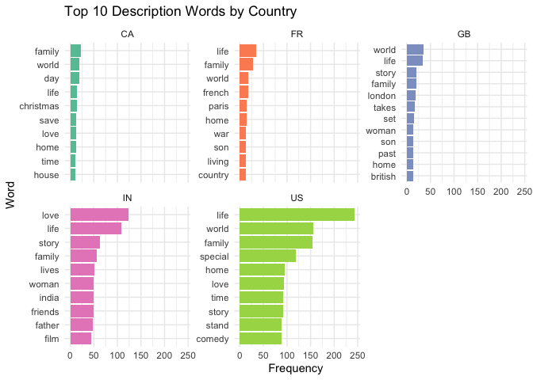
<p class="caption">
Top 10 Description Words by Country.
</p>

``` r
save_plot(word_plot, "word_plot.png")
```

South Africa’s most frequent words have a slightly different tilt than
the world’s top producers. Notably, frequent words include “south” and
“africa”, indicating the important of domestic storytelling in the
country. “Apartheid” is also amongst the most frequent, illustrating the
importance of the countries history. Similar to the patterns observed in
the rest of the world, words such as “love”, “life” and “family” are
also common in South Africa.

``` r
rsa_lollipop <- top_words_by_country(movies_by_country, countries = "ZA", top_n = 10) |> 
  top_words_lollipop(country = "ZA", top_n = 10)

rsa_lollipop
```

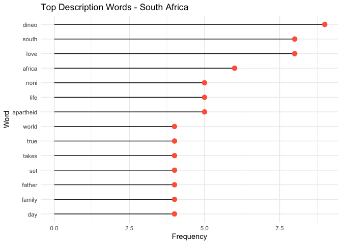
<p class="caption">
Top Description Words South Africa.
</p>
